# Overview API
## 1. Application Programming Interface (1960s)?
- bộ quy tắc (standard) giúp các phần mềm giao tiếp và trao đổi dữ liệu với nhau trong cùng một hệ thống hoặc giữa các hệ thống khác nhau.
- các hệ thống có thể phát triển riêng lẻ sau đó kết nối với nhau qua API > hoạt động như 1 hệ thống tổng thể

## 2. why need API test?
- Đảm bảo dữ liệu trả về đúng mong đợi & Giúp phát hiện lỗi sớm trước khi triển khai or tích hợp với phần khác
```
khi tách nhỏ hệ thống > test sớm & phát hiện lỗi sớm & điều chỉnh sớm
```
- Kiểm tra hiệu năng và độ ổn định trong mọi điều kiện tải cơ bản 
```
eg: tải user 100>1k..
```
- Đảm bảo API an toàn, tránh rò rỉ dữ liệu nhạy cảm <br>
```
eg: User input vào một form FE > dữ liệu request qua API đến BE - xử lý và response > FE hiển thị lại thông tin cho user
book grab > app grab gửi request đến API của hệ thống quản lý xe > hệ thống xử lý yêu cầu tìm xe & API trả về dữ liệu > app nhận và hiển thị thông tin
```

Xảy ra lỗi bảo mật khi APi ko đc test:
- Response data ko đúng đối tượng
- Input vào không được validate đúng >> dễ bị tấn công qua input (SQL injection, XSS…)
- User truy cập dữ liệu trái phép


## 3. Common Types of API Testing
- **Functional Testing**: Kiểm tra chức năng API có đúng yêu cầu (input-output)
- **Load Testing**: Đánh giá hiệu suất khi API chịu tải lớn
- **Security Testing**: Kiểm tra các lỗ hổng bảo mật
- **Integration Testing**: API work tốt khi tích hợp vào hệ thống

## 4. Types of APIs

|     API Type          |                       Description                                     |         Testing                   |
| ----------------------| ----------------------------------------------------------------------| --------------------------------- |
| REST (Web API)        | Simple, popular, uses HTTP methods (`GET`, `POST`,...)                | Functional, Load, Security        |
| SOAP (Web API)        | Enterprise-level, XML-based, strict format                            | Functional, Load, Security        |
| GraphQL (Web API)     | Flexible querying, client-defined data, good for complex data         | Functional, Security, Integration |
| Library/Framework API | API từ thư viện/framework (Java, React...) giúp reuse chức năng có sẵn| Integration, Functional           |
| OS API                | Giao tiếp giữa ứng dụng với hệ điều hành                              | Integration, Security             |
| Hardware API          | Giao tiếp phần mềm ↔ phần cứng (Camera, Printer, USB...)              | Integration, Functional           |

### Web API: REST, SOAP, GraphQL
API giao tiếp giữa các system (web/mobile) qua HTTP protocol
- **REST** 
    - simple & popular
    - HTTP methods: `GET`, `POST`, `PUT`, `DELETE`

- **SOAP**
    - for enterprise systems, requiring high security & reability
    - use XML to transfer data
    - more strucutured & formal compared to REST

- **GraphQL**
    - for system with complex data
    - (2012) flexible quẻrying, easy to maintain
    - allow clients to fetch exactly data need, optimizing performance

## 5. API testing tools
- **Manual**: Postman, cURL, IntelliJ, JMeter, SOAP UI
- **Automation**: Playwright, RestAssured, Cypress, Karate, Katalon, Selenium, WebdriverIO

|   tool      |        test             |        description                  |
| ----------- | ----------------------- | ----------------------------------- |
| Postman     | Manual, Security        | Gửi request, test response          |
| cURL        | Manual                  | Command-line gửi HTTP request       |
| IntelliJ    | Manual                  | Tích hợp API testing trong IDE      |
| JMeter      | Load                    | Mô phỏng nhiều user, test hiệu năng |
| SOAP UI     | Functional, Load        | Test SOAP & REST nâng cao           |
| Playwright  | Automation, Integration | Test API & UI song song             |
| RestAssured | Automation              | Java lib test REST                  |
| Cypress     | Automation              | Frontend + API cùng lúc             |
| Karate      | Automation              | Viết test bằng Gherkin DSL          |
| Katalon     | Manual + Automation     | No-code cho API + UI                |
| Selenium    | UI Testing              | Chủ yếu test UI                     |
| WebdriverIO | Automation              | Node.js framework cho API + UI      |

### 6. Định dạng dữ liệu phổ biến
|   Format   |            description                                         | thường dùng với API     |
| ---------- | -------------------------------------------------------------- | --------------------------- |
| **JSON**   | Nhẹ, dễ đọc/ghi, key-value, phổ biến, không phụ thuộc ngôn ngữ | REST, GraphQL               |
| **XML**    | Dạng thẻ, rõ ràng nhưng verbose, validate bằng schema          | SOAP                        |

----------------------------------------------------------------------------------------------------------------------------
# REST API 
## Representational State Transfer ?
- hoạt động theo mô hình Client - Server qua HTTP protocol

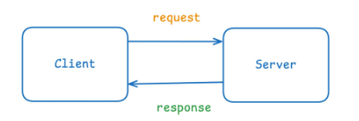
## 2. Request – Components of an API Request

- **Method**     | HTTP methods - action that the client wants to perform with resources on the server

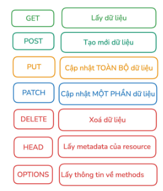|


- **URL** | The address used to locate a resource on the server:
    - `scheme`: protocol used for communication `http`, `https`
    - `domain`: main server address
    - `path`: specific location of the resource on the server
    - `query`: optional parameters in `key=value` format, 1st query followed by `?`, 2nd query joined by `&`
    - `fragment`: identifies a section within the page

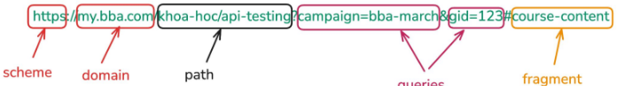|


- **Header**     | Data đi đầu trong mỗi request, key-value trong request HTTP để truyền tải thông tin bổ sung giữa client và
server. Các nhóm: 
    - `Authorization headers`: Chuyên cho việc xác thực

    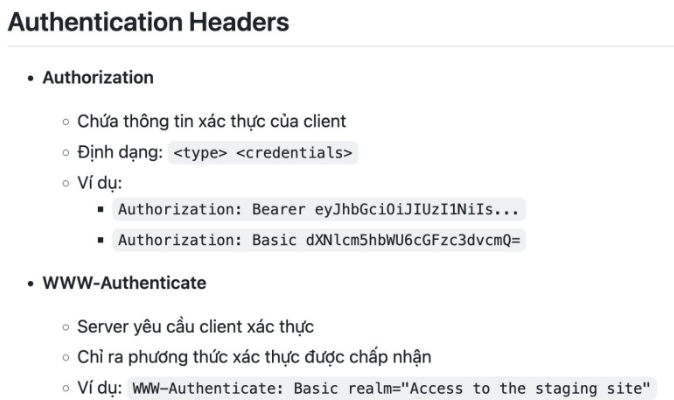
    
    - `Content headers`: khai báo kiểu dữ liệu mà client gửi lên

    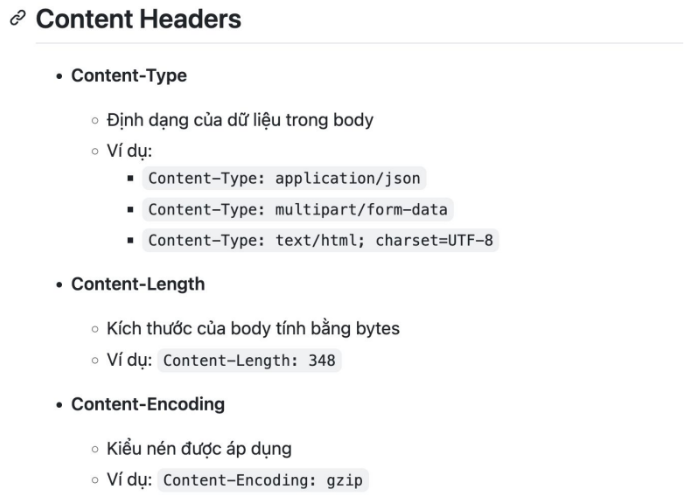

    - `Caching headers`: liên quan đến bộ nhớ đệm (cache)

    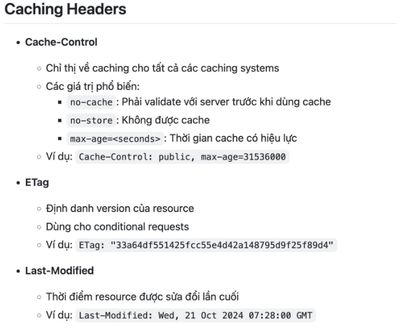

    - Security headers: liên quan đến bảo mật

    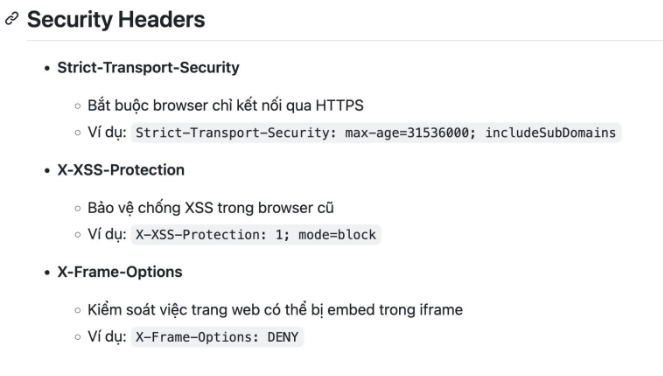

    - `CORS headers`: liên quan tới việc chia sẻ dữ liệu giữa các domain khác nhau

    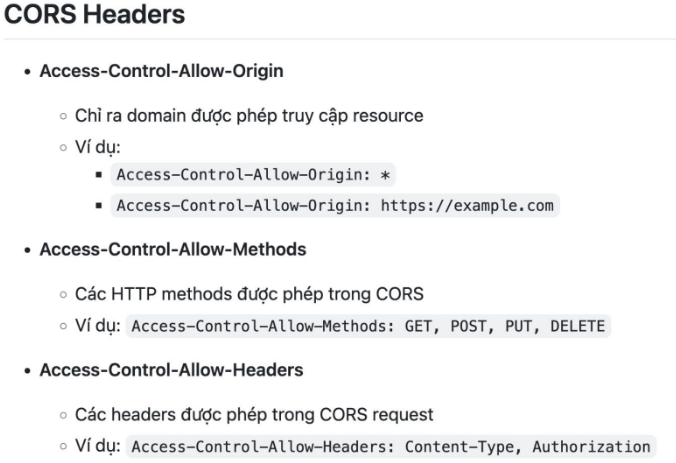


- **Body**       | Dữ liệu gửi lên server khi cần (POST, PUT, PATCH), thường ở dạng JSON, XML hoặc Form-Data
    - mã hóa or dùng HTTPs << tăng bảo mật
    - Request body hợp lý << tăng hiệu quả xử lý
    - Giảm sai sót trong giao tiếp giữa client vs server << hiểu đúng cách truyền dữ liệu

    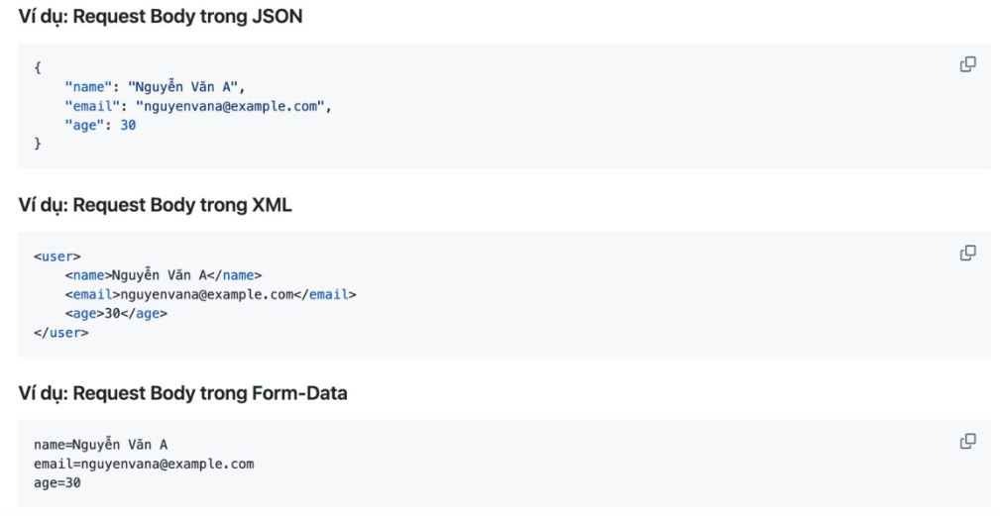
    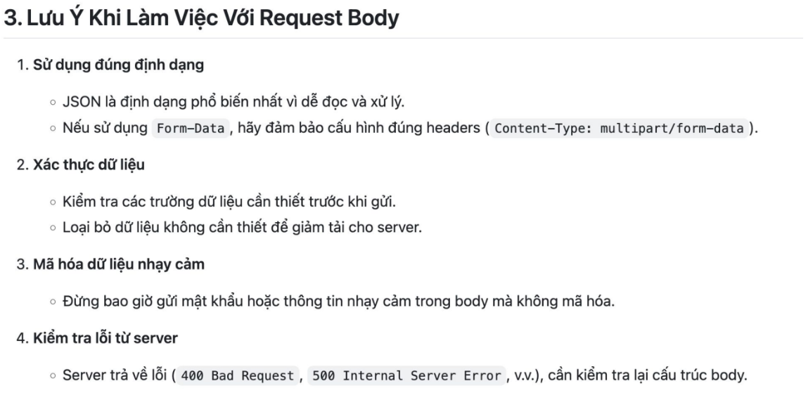


## 3. Response – Components of an API response

- **Status Code**   | báo kết quả request

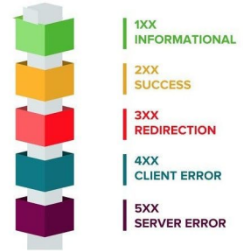

| **Header**        |
| **Body**          | 
